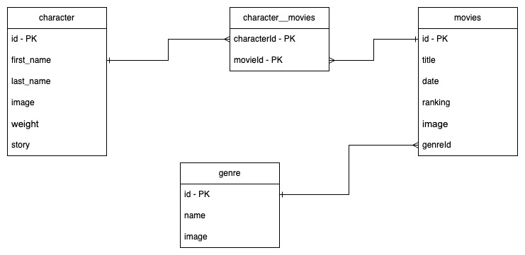

# Prueba x empresa

## Análisis y diseño
### Contexto
Se tiene un cliente el cual solicita la construcción de un servicio para Disney

### Diseño relacional



### Tecnologías utilizadas
- Nestjs
- TypeORM
- PostgreSQL
- PGAdmin

### Ejecución del proyecto
Para levantar el proyecto
- Clonar el proyecto
```
git clone https://www.github.com/ciucol/51120-coder
```


### Construcción
1. Creación del proyecto
2. Configuración base
3. configuración base de datos
4. Creación del modulo de personajes
   1. Creación del servicio de obtener todos los personajes